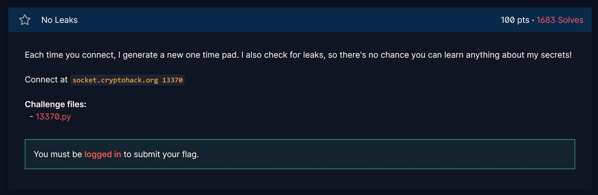

# Cryptohack (2019)

## Intro

My old solutions to problems on [Cryptohack](https://cryptohack.org/).

This was just a fun way for me to explore symmetric and public-key cryptography, much like how I used to solve problems on [Project Euler](https://projecteuler.net/).

Some of the challenges are so old that they are now [archived challenges](https://cryptohack.org/challenges/ctf-archive/), as the website has been updated a lot since I coded the solutions for their initial challenges.

## Improvements

Like with [pagerank](https://github.com/amanda-amy-frost/pagerank), I do not consider this code to be high quality for two reasons: 1) I was still new to Python at the time, and 2) my focus was on solving the problem and then moving on. After all, the code for these problems is meant as a learning exercise, not a product to be maintained.

[tourists](https://github.com/amanda-amy-frost/tourists) is much more recent and better example of my quality of code and documentation. However, I also happened to recently rewrite one of these old cryptohack exercises just to see what I would do differently, and the two different approaches can be compared. See [leaks_solution.py](./misc/leaks_solution.py) and [leaks_solution_2026.py](./misc/leaks_solution_2026.py), as well as a definition of the problem under Cryptohack's [misc problems](https://cryptohack.org/challenges/misc/) (No Leaks).

## A brief quantum aside

Cryptohack has added a whole [section](https://cryptohack.org/challenges/post-quantum/) devoted to problems that relate to quantum cryptography, and while I haven't done those exercises, I still keep up with developments in that space. For example, I find understanding [Grover's algorithm](https://www.youtube.com/watch?v=RQWpF2Gb-gU) and [Shor's algorithm](https://www.youtube.com/watch?v=lvTqbM5Dq4Q) to be utterly fascinating.

The former is more beautiful that the latter in my opinion, even though Shor's algorithm is an $O(\log n)$ way of factoring prime numbers, which completely breaks RSA encryption. Although Grover's algorithm is "only" an $O(\sqrt n)$ speed-up, it is much more generally applicable, as it works for all [NP-complete](https://en.wikipedia.org/wiki/NP-completeness) problems!

Being able to much more fully grasp the fundamentals of quantum mechanics - superposition, entanglement, decoherence, and all the rest - and understand what those concepts actually mean at a mathematical level is also something that I first understood when I explored how quantum computers work.

"Oh, a qubit is just a complex unit vector in a high-dimensional Hilbert space, where the magnitude of each component of the vector represents the square root of the probability of observing that outcome due to the [Born rule](https://en.wikipedia.org/wiki/Born_rule), which in [Everettian quantum mechanices](https://plato.stanford.edu/entries/qm-everett/) (or [pilot wave](https://en.wikipedia.org/wiki/Pilot_wave_theory) for that matter) is derived from the axioms rather than an axiom itself! (Moreover, the real component of the vector represents the amplitude of the wave, and the imaginary component gives the phase!)"

The 3Blue1Brown video for Grover's algorithm above explains it extremely well (without relying on knowledge of quantum physics), but the reason for adding this aside is that quantum mechanics is such a weird topic that is so difficult to understand by analogy. I just find this stuff fascinating and couldn't help sharing videos that help demystify the inner workings of the field.
